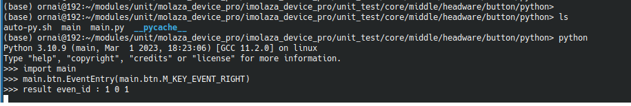

# Unit_Develop

#### 介绍
关于固件的全部模块开发分支


#### 如何使用
1. 进入单元测试文件夹的pyton文件夹中 比如 molaza_device_pro/imolaza_device_pro/unit_test/core/middle/headware/button/python
2. 命令行进入python环境
3. 导入文件
4. 在合适的时机调用触发事件
5. 结果将回调函数


##### Python 使用示例

```


        # 导入库文件
        from  ctypes import *
        import _thread
        import time
        import faulthandler


        # 开启DEBUG
        faulthandler.enable()

        class Button :
            Test =  CDLL('../out/libbutton.so')
            c_function_cb = None
            time_ms = 0

            M_KEY_EVENT_LEFT = 0
            M_KEY_EVENT_RIGHT = 1
            M_KEY_EVENT_START = 2
            M_KEY_EVENT_STOP = 3

            def __init__(self,Obj):
                self.Test = Obj
                self.Start()

            # 事件触发 外部随时调用
            def EventEntry(self,kry_event_id):
                # self.Test.m_ext_drive_gpio_get_level()
                # 事件触发
                self.Test.m_callable_key_event_enter( kry_event_id, self.time_ms)
                self.Test.add(self.c_function_cb)

            def  m_callable_key_handle(self,key_id,  pre_key_index,  current_key_index , current_time_ms):
                # 回调函数 结果处理，具体参数详情API
                print("result even_id :" ,key_id ,pre_key_index, current_key_index ,current_time_ms)
                return 0
            
            # 执行函数 调用按键检测
            def Main(self):
                while True :
                    # 1ms
                    time.sleep(0.001)
                    self.time_ms = self.time_ms + 1 
                    # 开始检测按键状态
                    self.Test.m_static_drive_key_function_monitor(self.time_ms)
                    # self.Test.main()

            # 初始化
            def Start(self):
                self.Test.m_callable_key_init()
                CFUNC = CFUNCTYPE(c_int,c_int,c_uint8,c_uint8,c_uint64)
                self.c_function_cb = CFUNC(self.m_callable_key_handle)
                # 注册回调处理的函数 所有模块一样
                self.Test.add(self.c_function_cb)
                _thread.start_new_thread(self.Main, ())


        # if __name__ == '__main__' :
        Object = CDLL('../out/libbutton.so')
        btn = Button(Object) 
    
    
    
    
```


#### 软件架构
软件架构说明


- 计划管理 
  1. 10min请求	
    "反馈处理:
        * 区域调整（智能计划、区域时间）
        * 天气跳过（需要产生事件分发）
        * 实例生成"
  2. 生成下次运行时间	
        * 包含计划运行的年月日时分秒
  3. 产生计划运行时间
        * 应该考虑计划类型：奇偶数，特殊天、间隔天，日出日落。water delay 单次跳过，休眠模式。（需要产生事件分发）
  4. 天气跳过管理	
        * 根据天气跳过计划进行45min请求
  5. 跳过通知管理	
        * 包含water delay 单个计划区间跳过，休眠模式、计划跳过一次
  6. 区域管理	
        * 离线区域运行百分比区域禁用启用

- 事件分发单元--
  1. 时间链表	
        * 给定一个时间，到点通知
  2. 事件分发	
        * 根据节点通知处理 运行10min请求，运行开始，运行超时。"

- 网络传输--
    1. 接收队列
    2. 发送队列


- 网络接收分发--
  1. 设置	
    设备属性
  2. 同步	
    同步单元
  3. 处理	
    运行事件
- 同步单元--
    1. 时间
    2. 经纬度
    3. 计划
- 设备属性--
    1. 设备全局属性设置和获取
- 传感器检测--
    1. 产生连接和断开时事件
    2. 设置传感器类型（常开常闭）和接线端子"
- 电流和短路检测--
    1. 设置开启关闭
    2. 每隔30s检测事件 
    3. 短路事件 (短路不参与浇水统计)

- 时间更新单元--
    1. 时区调整（更新RTC）
    2. 设置夏令时、冬令时
    3. 夏令时、冬令时切换
- wifi连接管理单元--
    1. IP地址存储和自己配置IP
    2. DNS配置
    3. 连接异常（异常处理和灯光效果）
    4. 断开自动重连
- 蓝牙连接管理单元--
    1. 和socket相互事件转发（期间指令需要缓存）
- 设备配网单元--
    1. 接收解析
    2. 判断离线改wifi、添加设备、离线使用
    3. 错误处理（错误码）
- 网络连接--
    1. 通过http获取IP地址
    2. socket(mqtt)主动连接、自动重连
    3. 连接稳定：长连接
- 按键检测--
    1. 识别按键
    2. 事件分发
- 区域驱动管理--
    1. 区分芯片类型
    2. 产品类型
    3. 多路运行
    4. 灯光更新事件"
- 灯光单元--
    1. 状态机（开机动画）
- 设备运行模式--
    1. 配网模式和正常模式和离线运行模式
- RTC管理--
    1. 设置和获取更新时间
- flash读写--
    1. 设置获取flash
- 指令解析--
    1. sock的cmd解析
- JSON解析--
    1. 配网特殊字符解析和正常解析
- 设备状态机--
    1. 初始化状态
    2. 空闲状态
    3. 计划运行状态
    4. 计划浸泡状态
    5. 快速运行运行状态
    6. 快速运行浸泡状态
    7. 快速运行暂停状态
    8. 手动运行运行状态
    9. 更新状态"
- 设备自检--
    1. RTC连接和功能检测
    2. IO拓展开关检测
    3. 灯光驱动检测
- 电流检测单元--
    1. 接收区域id开启并检测，返回电流


#### 图表


#### 安装教程
拉取即可使用

#### 参与贡献

1.  Mao
2.  Zhang


#### 特技

1.  使用 Readme\_XXX.md 来支持不同的语言，例如 Readme\_en.md, Readme\_zh.md
2.  Gitee 官方博客 [blog.gitee.com](https://blog.gitee.com)
3.  你可以 [https://gitee.com/explore](https://gitee.com/explore) 这个地址来了解 Gitee 上的优秀开源项目
4.  [GVP](https://gitee.com/gvp) 全称是 Gitee 最有价值开源项目，是综合评定出的优秀开源项目
5.  Gitee 官方提供的使用手册 [https://gitee.com/help](https://gitee.com/help)
6.  Gitee 封面人物是一档用来展示 Gitee 会员风采的栏目 [https://gitee.com/gitee-stars/](https://gitee.com/gitee-stars/)

